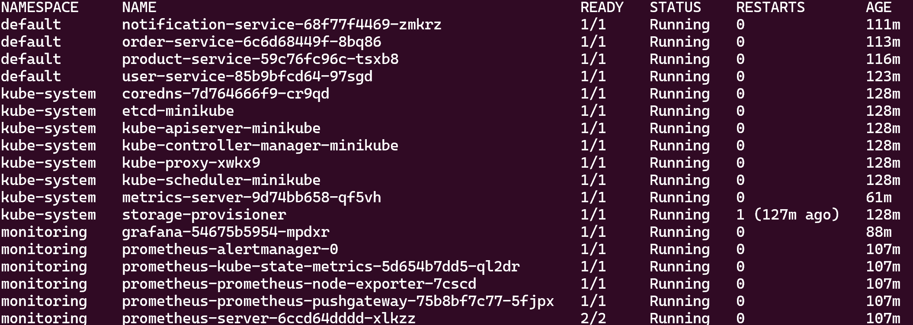
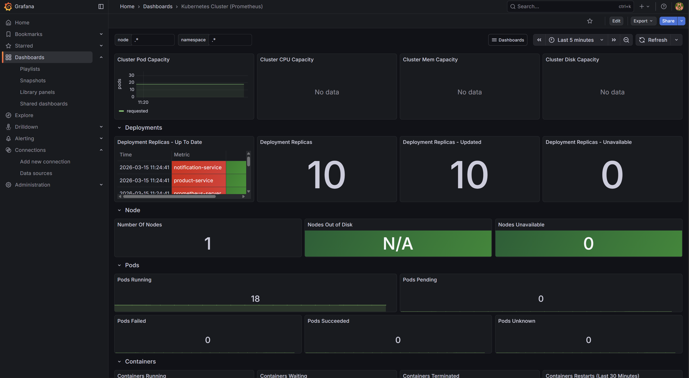
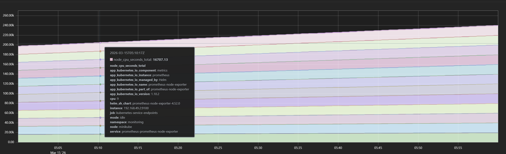
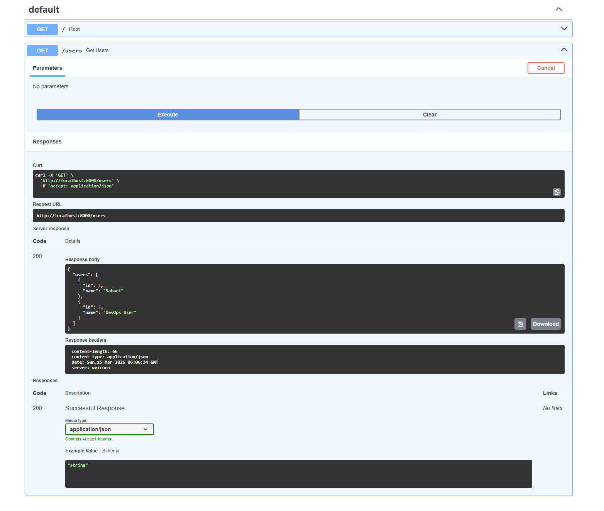
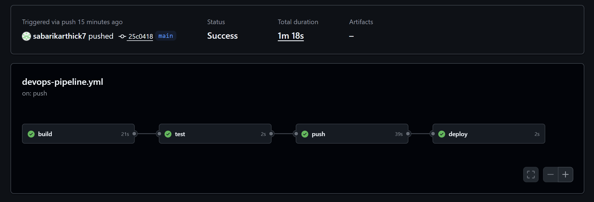

# Kubernetes Microservices DevOps Platform 🚀

## 📌 Project Overview

This project demonstrates a **complete DevOps pipeline for deploying microservices on Kubernetes** with monitoring and CI/CD automation.

The system uses **FastAPI microservices**, containerized with **Docker**, deployed on **Kubernetes**, monitored with **Prometheus & Grafana**, and automated using **GitHub Actions CI/CD**.

---

## 🏗️ Architecture

```
Developer Push Code
        │
        ▼
GitHub Repository
        │
        ▼
GitHub Actions CI/CD
   ├── Build Docker Images
   ├── Run Tests
   ├── Push Images to Docker Hub
   └── Deploy to Kubernetes
        │
        ▼
Kubernetes Cluster (Minikube)
   ├── user-service
   ├── product-service
   ├── order-service
   └── notification-service
        │
        ▼
Monitoring Stack
   ├── Prometheus (Metrics Collection)
   └── Grafana (Visualization)
```

---

# 🧩 Microservices

The platform contains **four FastAPI microservices**:

| Service              | Description                 |
| -------------------- | --------------------------- |
| user-service         | Manages user data           |
| product-service      | Handles product information |
| order-service        | Processes orders            |
| notification-service | Sends notifications         |

---

# ⚙️ Tech Stack

* **FastAPI** – Microservices framework
* **Docker** – Containerization
* **Kubernetes (Minikube)** – Container orchestration
* **Prometheus** – Metrics monitoring
* **Grafana** – Dashboard visualization
* **GitHub Actions** – CI/CD automation

---

# 🚀 CI/CD Pipeline

The GitHub Actions pipeline performs the following steps:

1️⃣ **Build Stage**
Build Docker images for all microservices.

2️⃣ **Test Stage**
Run service checks.

3️⃣ **Push Stage**
Push Docker images to Docker Hub.

4️⃣ **Deploy Stage**
Deploy services to Kubernetes.

Pipeline workflow:

```
build → test → push → deploy
```

---

# 📊 Monitoring

Monitoring is implemented using:

### Prometheus

Collects metrics from:

* Kubernetes cluster
* Node exporter
* Microservices

### Grafana

Displays dashboards for:

* Cluster health
* Node CPU & memory usage
* Pod status
* Service monitoring

---

# 📷 Project Screenshots

## Kubernetes Pods



## Grafana Dashboard



## Prometheus Metrics



## FastAPI Microservice



## GitHub Actions Pipeline



---

# 🛠️ Setup Instructions

### Clone Repository

```
git clone https://github.com/sabarikarthick7/kubernetes-microservices-devops.git
cd kubernetes-microservices-devops
```

### Start Kubernetes Cluster

```
minikube start
```

### Deploy Microservices

```
kubectl apply -f k8s/
```

### Check Running Pods

```
kubectl get pods
```

---

# 📈 Monitoring Setup

Install monitoring stack:

```
helm install prometheus prometheus-community/kube-prometheus-stack
```

Access dashboards:

```
Prometheus → http://localhost:9090
Grafana → http://localhost:3000
```

---

# 🎯 Key Features

✔ Microservices architecture
✔ Containerized services using Docker
✔ Kubernetes deployment
✔ CI/CD automation with GitHub Actions
✔ Real-time monitoring with Prometheus & Grafana

---

---

# 👨‍💻 Author

**Sabari Karthick**
DevOps Enthusiast

GitHub:
https://github.com/sabarikarthick7
